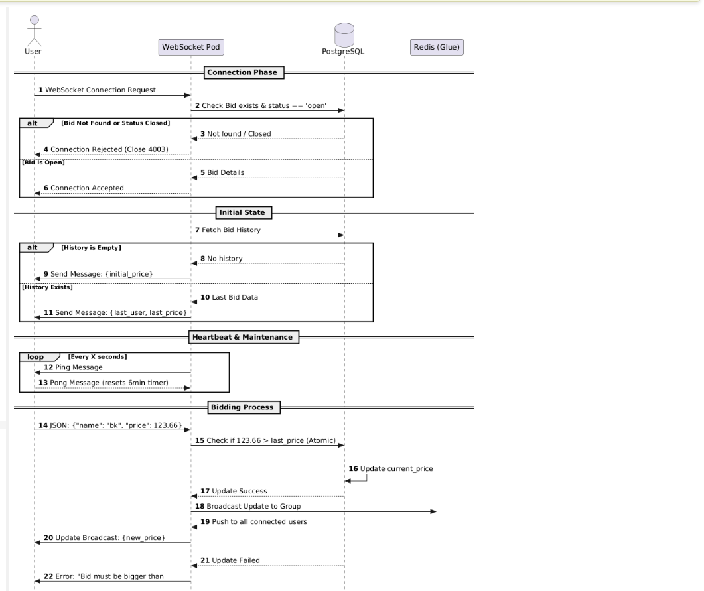
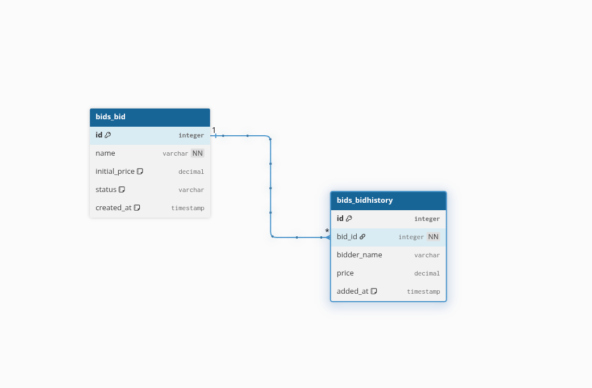

# Bidding-Application
Distributed scalable backend bidding platform designed to handle real-time auction events with extreme precision and reliability

### Communications 

use websockets with real time communications and with immediate updates for product when prices raises 

### How it works 
backend distributed over multi pods, nodes 
user connect via web socket url 
- user connected via web sockets with `BID` id 
- `BID` user connected to it must be exists with status `OPEN` 
- once user connected user receives Bid price history 
- if bid don't have price history user will receive `bid initial price` 
- if bid have history price user will receive `pid history price` once connected 
- `heart beat` signal task starts for the user once connected with `ping` message 
- if user sends back `pong` or do a bid price the time for connection is updated 
- if server don't receive `pong` or price update for 6 minues will assume user droped 
- user can send new price in format json like blow and price must be greaer than last price of bid has history if it don't have must be greater than initail price 
```json
{
"name":"USER NAME", "Price":112233.44
}
```
- by default initail price is `100.00`, parsed price can be int or decimal  and it will be rounded to to `2` persicion after point `.` 
- sequnce diagram as blow


### ENV variables 
|Name|Description|
|:--- | :---: |
|ENV | the enviroment where app will run |
|APP_NAME | app title |
|APP_VERSION | app version used for software versioning |
|APP_PORT| the port app will be exposed on |
|SECRET_KEY| secret key for app |
|ALLOWED_HOSTS| allowed hosts to access and share data with app |
|LOG_LEVEL| the level of application log|
|DEBUG|weather to show debugging info or not, never allowed in production|
|REDIS_URL| the redis url app will connect on it|
|POSTGRES_USER| the postgesql server user|
|POSTGRESS_PASSWORD| postgres user password on database| 
|POSTGRES_PORT| the postgres port of connection|
|POSTGRES_DB| name of db on postgres | 

### Database Table Schema 
- by default status for `BID` is `open` 
- by default `initial_price` is `100.00` 
- `created_at` and `added_at` by default takes the time when they added to database 
- price for `BidHistory` being rounded by 2 decaml places 


### Libararies 
|Name| Description|
|:-|:-|
|Django| python backend framework|
|channels| real time communication websocket support for django|
|daphne| asgi server support|
|redis| for redis database connection|
|pydantic| for validatation and serialization|
|pydantic-seetings| for configure setting and manage secrets on local|
|psycopg2 | postgresql library in python |
|loguru| for async logging support|
|poetry| python project management dependancies | 

### Component Integrations 
|Name| Usage|
|:-|:-|
|Redis| in memory database as as a `glue` between nodes and support channel layers|
|Postgresql| realtional database management system for store bids and history over each bid 
|Docker| dockerzing app backend |
|Docker Compose| for multi container app operate|
|Kind| kubernetes in docker allow to create local cluster k8s with multi node |
|Kubectl| for cluster control|

### Operate App 
#### Using Docker
- define you env files in root project call it `.env` 
- run `docker compose up --build` the docker start pull images and buildone for backend and you can access it using port `8000`


#### For locaql cluster KIND
- cd into `kind-k8s-cluster-deployment` 
- define `env` varibales like `.env` 
- load the docker image from backend `kind load docker-image {image_name"tag} --name {clster name}`
- the files for each part include the service and deployments and so on 
- for redis there is the `statfulset` with `service` 
- for postgres we have `statefulset` and `service` 
- app backend we have `service` and `deployment` with replicas of 2 also we have `job` as this apply db migrations and seed inital data into db for testing 
- also we have `kustomization` that will create configmaps and secrets for all 
- to apply these files just type `kubectl apply -k .` 
- this will apply all yaml files configuration to cluster 
- add the domain `bidding-app.local` to `/ect/hosts` them you can access the app using this domain from local host 

### for testing 
- you can expose local to internet using tools like `ngrok` 
- for this project i used [PieHost](https://piehost.com/websocket-tester)